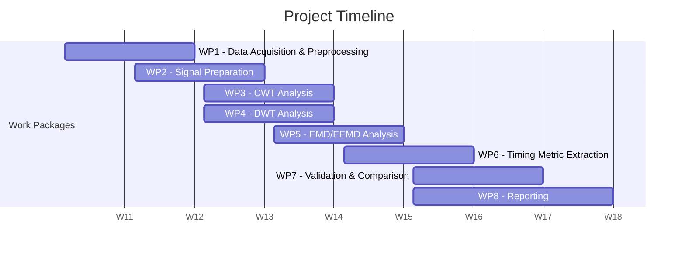

> **ECE 866 Term Project**


<!--  -->
<!--  -->

> Table of Contents

- [1. Description](#1-description)
- [2. Project Management Plan](#2-project-management-plan)
  - [2.1. Work Packages](#21-work-packages)
  - [2.2. Schedule](#22-schedule)
- [3. Getting Started](#3-getting-started)
  - [3.1. Requirements](#31-requirements)
  - [3.2. Installation \& Setup](#32-installation--setup)
    - [3.2.1. Clone Git Repository](#321-clone-git-repository)
    - [3.2.2. Create Virtual Environment](#322-create-virtual-environment)
    - [3.2.3. Install Python Packages](#323-install-python-packages)
  - [3.3. Running](#33-running)
    - [3.3.1. Python Modules](#331-python-modules)
    - [3.3.2. CLI Services](#332-cli-services)
      - [3.3.2.1. `fetch`](#3321-fetch)
- [4. Data](#4-data)
- [5. Documentation](#5-documentation)
- [6. Unit Testing](#6-unit-testing)
- [7. Reference](#7-reference)
  - [7.1. Data Sets](#71-data-sets)
- [8. Developer Notes](#8-developer-notes)
  - [8.1. Documentation](#81-documentation)

# 1. Description

This repository contains the code and documentation for the ECE 866 term project
*Multi-Scale Analysis of Terrestrial Vegetation Phenology Using Wavelet and Empirical
Mode Decomposition Methods*. The project investigates the application of time-frequency
analysis methods — specifically the continuous wavelet transform (CWT), discrete wavelet
transform (DWT), and empirical mode decomposition (EMD/EEMD) — to terrestrial vegetation
phenology signals derived from MODIS satellite imagery over the state of Michigan from
2001 to 2020. Phenological timing metrics are extracted directly from the time-frequency
domain and compared across decomposition methods and against the MODIS Land Surface
Dynamics product (MCD12Q2) as an independent validation reference.

# 2. Project Management Plan

## 2.1. Work Packages

| ID | Title | Weeks |
|----|-------|-------|
| WP1 | Data Acquisition & Preprocessing | W11–W12 |
| WP2 | Signal Preparation | W12–W13 |
| WP3 | CWT Analysis | W13–W14 |
| WP4 | DWT Analysis | W13–W14 |
| WP5 | EMD/EEMD Analysis | W14–W15 |
| WP6 | Timing Metric Extraction | W15–W16 |
| WP7 | Validation & Comparison | W16–W17 |
| WP8 | Reporting | W16–W18 |

**WP1 — Data Acquisition & Preprocessing**
Raw NDVI and EVI time series data are obtained from the MODIS Vegetation Indices 16-Day
L3 Global 500m products (MOD13A1 and MYD13A1) for the state of Michigan over the period
2001–2020. Pixels corrupted by cloud cover, shadow, or snow are masked using the product
quality flags. Gaps introduced by pixel masking are filled using interpolation prior to
further analysis.

**WP2 — Signal Preparation**
Masked and gap-filled pixel time series are assembled into spatially and temporally
consistent data structures suitable for decomposition. Exploratory analysis is performed
to characterize the general phenological structure of the signals, identify any remaining
data quality issues, and inform parameter choices for the decomposition methods in WP3–WP5.

**WP3 — Continuous Wavelet Transform Analysis**
The CWT is applied to the prepared vegetation index time series using either the Morlet
or Gaussian derivative wavelet, with the choice informed by exploratory analysis in WP2.
The resulting time-frequency representations are used to characterize multi-scale
phenological signal components and, if the stretch goal is pursued, to perform wavelet
coherence analysis against environmental driver data.

**WP4 — Discrete Wavelet Transform Analysis**
The DWT is applied in parallel with WP3 using the Meyer wavelet, following convention
in the ecology and environmental literature. The discrete decomposition isolates
phenological signal components at relevant temporal scales for subsequent timing metric
extraction in WP6.

**WP5 — EMD/EEMD Analysis**
Empirical mode decomposition and its ensemble variant are applied as a data-adaptive
alternative to the wavelet-based methods in WP3 and WP4. The resulting intrinsic mode
functions (IMFs) are transformed using the Hilbert-Huang transform to obtain
time-frequency spectra comparable to those produced by the CWT and DWT.

**WP6 — Timing Metric Extraction**
Phenological timing metrics are extracted from the time-frequency representations
produced by each decomposition method in WP3–WP5. Metrics include the number of
vegetation cycles per year, onset of greenness, greenup midpoint, maturity, peak
greenness, senescence, greendown midpoint, and dormancy. Results are compiled across
all three methods for comparison in WP7.

**WP7 — Validation & Comparison**
Timing metrics extracted in WP6 are compared across decomposition methods and evaluated
against the MODIS Land Surface Dynamics product (MCD12Q2) as an independent reference.
The analysis assesses the relative performance of adaptive versus fixed-basis methods
and whether time-frequency-derived metrics offer a meaningful alternative to classical
curve-fitting approaches.

**WP8 — Reporting**
Results from WP3–WP7 are synthesized into the final project report. Writing and figure
preparation begin no later than W16 to allow adequate time for revision. The report
discusses the methodological comparison, timing metric extraction results, and
implications for future extensions to aquatic phenology and forecasting.

## 2.2. Schedule



# 3. Getting Started

## 3.1. Requirements

- Python>=3.12
- MATLAB 2025b

## 3.2. Installation & Setup

### 3.2.1. Clone Git Repository

**HTTPS**

```bash
git clone https://github.com/yungtymunny/ece866-term-project.git
```

### 3.2.2. Create Virtual Environment

**MacOS/Linux**

From the terminal, run the following commands to create your virtual environment. (Edit the paths and virtual environment name appropriately.)

```bash
cd path/to/virtualenvs
python3 -m venv ece866-3.12
```

> [!NOTE]
> You may wish to use the `pyenv` tool for managing your virtual environments. `pyenv` lets you easily switch between multiple versions of Python. It's simple, unobtrusive, and follows the UNIX tradition of single-purpose tools that do one thing well. If you wish to use `pyenv`, visit [the GitHub page](https://github.com/pyenv/pyenv) for more information and installation instructions.

### 3.2.3. Install Python Packages

From the terminal, run the following commands to install the Python packages included in this project.

```bash
cd path/to/ece866-term-project
pip install -e .
```

If you are a developer, modify `pip install` command according to your needs.

| Command | Description |
|---------|-------------|
| `pip install -e ".[dev]"` | Installs dependencies required for linting and testing. |
| `pip install -e ".[docs]"` | Installs dependencies required for generating the documentation. |
| `pip install -e ".[dev,docs]"` | Installs dependencies required for linting ,testing, and generating the documentation. |

## 3.3. Running

To access the modules and CLI services provided by the `ece866` Python package, begin by activating your virtual environment.

**MacOS/Linux**

```bash
source /path/to/virtualenvs/ece866-3.12/bin/activate
```

### 3.3.1. Python Modules

This project provides the following three Python modules:
- `gis`
- `time_frequency`
- `utils`

The modules are structured as follows.

```bash
.
├── gis
│   ├── __init__.py
│   ├── data
│   │   ├── __init__.py
│   │   ├── conditioning.py
│   │   ├── io.py
│   │   └── mpc.py
│   └── geometry.py
├── time_frequency
│   ├── __init__.py
│   ├── analyzeCWT.m
│   ├── analyzeDWT.m
│   ├── analyzeEMD.m
│   ├── TimingMetrics.m
└── util
    ├── __init__.py
    ├── cli.py
    ├── dates.py
    ├── logger.py
    └── math_utils.py
```

These module can be imported into scripts, web-based applications, and the like.

**Examples**

```python
from gis.data.mpc import download_modis_13a1_061
from gis.geometry import load_geom, to_bbox
from util.logger import Logger
```

### 3.3.2. CLI Services

This project also provides the following command line (CLI) services.
- `doc`
- `fetch`

From the terminal, run `<cli-service> --help` to see the available command line options.

#### 3.3.2.1. `fetch`

The `fetch` service is provided to support searching and downloading data.

```bash
usage: fetch [-h] -p {modis-13a1-061} -g GEOM_FILE -ys START_YEAR -ye END_YEAR [-o OUT_FOLDER] [--use-cache] [--debug]

A tool for downloading data sets for the ECE 866 term project.

options:
  -h, --help            show this help message and exit
  -p {modis-13a1-061}, --product {modis-13a1-061}
                        [required] data product to download
  -g GEOM_FILE, --geom-file GEOM_FILE
                        [required] full path to geometry file
  -ys START_YEAR, --start-year START_YEAR
                        [required] first year to start searching for data
  -ye END_YEAR, --end-year END_YEAR
                        [required] last year to start searching for data
  -o OUT_FOLDER, --out-folder OUT_FOLDER
                        [optional] folder for storing data
  --use-cache           [optional] flag indicating whether to use cached data
  --debug               [optional] flag indicating whether to print debug messages
```

# 4. Data

The analysis carried out in this project requires access to the following data sets.
- MOD13A1/MYD12A1
- MCD12Q1
- MCD12Q2
- ERA5 *(Optional)*

This data needs to be downloaded before running the analyses.

**MOD13A1/MYD13A1**

Use the provided `fetch` CLI service to download the MOD13A1/MYD13A1 data products. The example command given below downloads the MOD13A1/MYD13A1 data products from the years 2001 through 2020 for the state of Michigan.

```bash
fetch -p modis-13a1-061 -g /path/to/ece866-term-project/data/geom/michigan.geojson -ys 2001 -ye 2020 -o /path/to/output-folder
```

**MCD12Q1**

The MCD12Q1 land cover type product is used to stratify analysis results by land cover class. It is not yet integrated into the `fetch` service. Download manually from [The Application for Extracting and Exploring Analysis Ready Samples (AppEEARS)](https://appeears.earthdatacloud.nasa.gov/) using `\path\to\ece866-term-project\data\geom\michigan.geojson` and the `WGS84` projection.

**MCD12Q2**

The MCD12Q2 land cover dynamics product serves as the independent validation reference for phenological timing metrics extracted in WP6–WP7. Download manually from [The Application for Extracting and Exploring Analysis Ready Samples (AppEEARS)](https://appeears.earthdatacloud.nasa.gov/) using `\path\to\ece866-term-project\data\geom\michigan.geojson` and the `WGS84` projection.

**ERA5** *(Optional)*

ERA5 atmospheric reanalysis data is required only if the wavelet coherence stretch goal
(WP3) is pursued. Data can be obtained from the [Copernicus Climate Data Store](https://cds.climate.copernicus.eu/).

# 5. Documentation

To generate the documentation, activate your virtual environment and run `doc`. The documentation should automatically open in the default webbrowser. Alternatively, run

```bash
cd path/to/ece866-term-project/sphinx
make html
```

Then, to view the documentation, open `path/to/ece866-term-project/sphinx/html/index.html`.

# 6. Unit Testing

The testing framework is configured in the `pyproject.toml` file. To run the unit tests, activate your virtual environment and run

```bash
cd path/to/ece866-term-project
pytest
```

A coverage report is generated in

```
path/to/ece866-term-project/reports
```

# 7. Reference

## 7.1. Data Sets

- [MODIS/Terra Vegetation Indices 16-Day L3 Global 500m SIN Grid V061 (MOD13A1)](https://www.earthdata.nasa.gov/data/catalog/lpcloud-mod13a1-061)
- [MODIS/Aqua Vegetation Indices 16-Day L3 Global 500m SIN Grid V061 (MYD13A1)](https://www.earthdata.nasa.gov/data/catalog/lpcloud-myd13a1-061)
- [MODIS/Terra+Aqua Land Cover Type Yearly L3 Global 500m SIN Grid V061 (MCD12Q1)](https://www.earthdata.nasa.gov/data/catalog/lpcloud-mcd12q1-061)
- [MODIS/Terra+Aqua Land Cover Dynamics Yearly L3 Global 500m SIN Grid V061 (MCD12Q2)](https://www.earthdata.nasa.gov/data/catalog/lpcloud-mcd12q2-061)

# 8. Developer Notes

## 8.1. Documentation

When updating the documentation for a new release, update the `release` variable in `sphinx/source/conf.py`.

```python
project = 'ECE 866 Term Project'
copyright = '2026, Tyler Doiron'
author = 'Tyler Doiron'
release = NEW_VERSION
```
